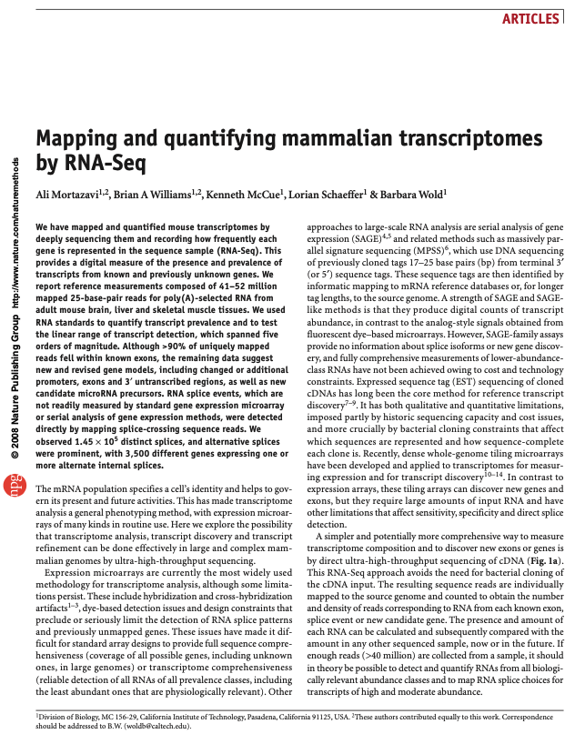
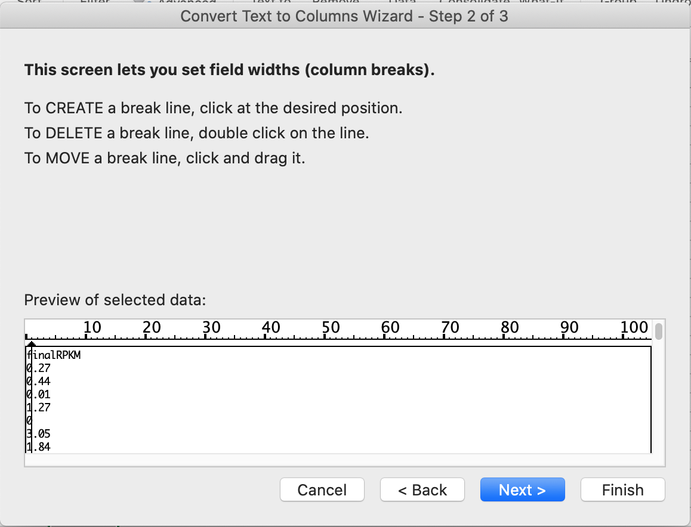
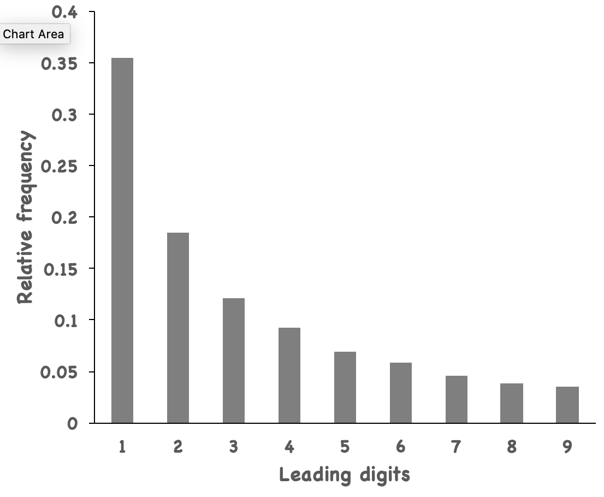

More than two years ago, I started to watch videos from the YouTube channel __[Numberphile](https://www.youtube.com/user/numberphile/)__. I came across __[Benford's Law](https://en.wikipedia.org/wiki/Benford%27s_law)__, and I was amazed when I saw it on __[this video](https://www.youtube.com/watch?v=XXjlR2OK1kM)__. Basically, Benford's Law is an observation about the relative frequency distribution of the first digigts from real-world data sets, where the data span multiple orders of magnitude. Intuitively, we expect them to be uniformly distributed so that each digit (from 1 to 9) has a relative frequency aournd 1/9. However, it turns out that 1 is the most frequent digit, and 2 is the 2nd most frequent digit, and so on. Since people who fabricate data tend to make the distribution uniform, Benford's Law can be used for fraud detection. After watching the Numberphile video, I immediately realised that RNA-seq data should follow Benford's Law as well. In each of the samples, you always have lowly expressed genes and highly expressed genes, and their expression values span several orders of magnitude. Indeed, there are papers about using Benford's Law to characterise patterns of gene expressions, such as __[this one](https://www.ncbi.nlm.nih.gov/pmc/articles/PMC4979126/)__ and __[this one](https://www.mdpi.com/2073-4409/8/9/1004)__. 

In this term, I started to teach junior undergraduates some basic data analysis skills. It would be nice if I could introduce Benford's Law to them, and I think they should be interested. Instead of just telling them the law, I decided to let them discover the law by themselves. The first thing is to find a data set for them. I just chose one from the _Nature Methods_ paper by [__Mortazavi__ ___et al.___](https://www.nature.com/articles/nmeth.1226) in 2008, because this is the first paper that comes to my mind when talking about RNA-seq. In reality, it is actually quite a few papers in 2007 and 2008 toegether that mark the start of the RNA-seq era. See an excellent review by [__Stark__ ___et al.___, __2019__](https://www.nature.com/articles/s41576-019-0150-2).

I took a screenshot of the frist page of the Mortazavi _et al._ paper and sent to the students:



Then the students were asked to find the paper and download the [Supplementary Data Set 1](https://static-content.springer.com/esm/art%3A10.1038%2Fnmeth.1226/MediaObjects/41592_2008_BFnmeth1226_MOESM22_ESM.txt) from the paper. Even though very few of them have read formal scientific literature before, they all know how to use search engines. Therefore, it is not a big problem for them to find the paper and download the Supplementary Data Set 1, which is a tab delimited text file that contains the gene expression values.

Then the students were asked to take the 6th column, _i.e._ the "finalRPKM" column of the file and plot the frequency distribution of the first digits of the numbers in that column, ignoring all numbers with leading 0s. If there are not many numbers, this can be easily done. However, there are more than 30,000 genes in that data, so there are more than 30,000 lines in the text file. If students know a bit programming, it is not a problem. However, not every student has programming experience when they just start their study in biology. They do use Microsoft Excel a lot.

To show them how to solve the problem, I demonstrated two approaches of doing it: by using Excel or by using a few Linux commands. In this way, they will understand the problem is solvable even without programming experience if they take whatever available tools they have, such as Excel. In addition, the problem is solved in seconds using Linux commands. This may motivate them to learn a bit command line magic.

First, let's have a look how to get it done by Excel. You need to import the text file to Excel. In Excel (my version is 2017), do `File` --> `Import` --> `Text file` --> click the `Import` button and choose the file. Then, choose `delimited`, click the `Next` button and choose `Tab` and click `Next` again. Now, it is important to show them that they need to set the `Column data format` of  the `gene` column that contains the gene names as `Text`. Otherwise, genes such as _March5_ or _Sept7_ will be converted to dates. I did a demontration to show them that, and this is a well-known problem in the early stage of genomics. For example, see these two papers by [__Zeeberg__ ___et al.___](https://bmcbioinformatics.biomedcentral.com/articles/10.1186/1471-2105-5-80) and [__Ziemann__ ___et al.___](https://genomebiology.biomedcentral.com/articles/10.1186/s13059-016-1044-7). At the time of this writing, it seems _March5_ and _Sept7_ are now officially _Marchf5_ and _Septin7_. Maybe these changes are made to prevent the problem. After importing the file, you need to choose the 'finalRPKM' column, and click the `Data` tab, and use `Text to Columns` option. When the Wizard show up, choose `Fixed width` and click the `Next` button. Now you will see a lot of tick marks in the `Preview of selected data`, and you simply click at the first tick, like this (note the vertical line with a black arrow on top):



After that, the first digit of every number is isolated. You can use the `COUNTIF` function of Excel to count the freqeuncy of 1, 2, 3, ..., and 9.

The second way of achieving the same goal is through Linux commands. Many bioinformatics people use python or perl for text processing, but sometimes Linux commands are just better and quicker. I showed the student that you can do this using essentially one line of commands in just a few seconds:

```shell
tail -n +2 41592_2008_BFnmeth1226_MOESM22_ESM.txt | cut -f 6 | cut -c 1 | awk '$1>0' | sort | uniq -c
```

Now let's break it up to see what each command does:

```shell
tail -n +2 41592_2008_BFnmeth1226_MOESM22_ESM.txt | \ # remove the header
cut -f 6 | \ # get the 6th column
cut -c 1 | \ # get the first character, i.e. the first digit
awk '$1>0' | \ # get rid of 0s
sort | uniq -c # count occurrence
```

Here is the result:

```
5411 1
2820 2
1839 3
1413 4
1050 5
 887 6
 701 7
 592 8
 530 9
```

If you plotted in a bar graph, it just looks like Benford's Law, although it is not that accurate. For example, number 1 appears ~35% of the time, but Benford's Law is not a strict law anyway.



I hope by demonstrating this, they are motivated to learn some Linux commands to start with their career in modern biology.